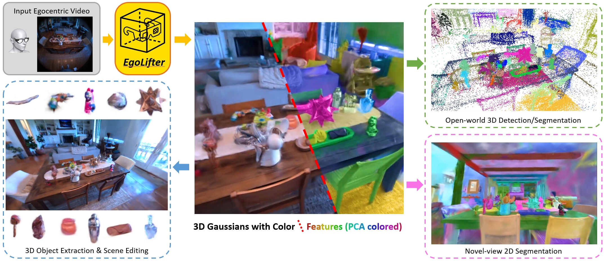

# EgoLifter: Open-world 3D Segmentation for Egocentric Perception

**ECCV 2024**

[**Project Page**](https://egolifter.github.io/) |
[**Paper**](https://arxiv.org/pdf/2403.18118.pdf) |
[**ArXiv**](https://arxiv.org/abs/2403.18118) |
[**Video**](https://youtu.be/dWuZyeiOXyM) |
[**Poster**](./assets/eccv24-egolifter-poster.pdf)

[Qiao Gu](https://georgegu1997.github.io/),
[Zhaoyang Lv](https://lvzhaoyang.github.io/),
[Duncan Frost](https://scholar.google.com/citations?user=P9l4zHIAAAAJ&hl=en),
[Simon Green](https://scholar.google.com/citations?user=VmHZtsEAAAAJ&hl=en),
[Julian Straub](https://people.csail.mit.edu/jstraub/),
[Chris Sweeney](https://scholar.google.com/citations?user=h-CpQGgAAAAJ&hl=en)



This repo contains the implementation of our recent work, EgoLifter: Open-world 3D Segmentation for Egocentric Perception. 

## Setup

### Clone the repo

```bash
git clone --recursive git@github.com:facebookresearch/egolifter.git

# Or run the following if you forget the `--recursive` flag
git submodule update --init --recursive
```

### Setup the environment and install packages. 
    
First download and install [Anaconda](https://docs.anaconda.com/free/anaconda/install/index.html) or [Miniconda](https://docs.anaconda.com/free/miniconda/index.html). Then create the environment and install packages using the following commands  

```bash
# This implementation is tested on Python 3.10
conda create -n egolifter python=3.10 pip
conda activate egolifter

# Install Pytorch (This implementation was tested with the following version of PyTorch)
conda install pytorch torchvision torchaudio pytorch-cuda=12.1 -c pytorch -c nvidia

pip install plyfile tqdm hdbscan open3d fsspec opencv-python imageio distinctipy natsort plyfile wandb imageio[ffmpeg] moviepy tyro lightning pretrained-backbones-unet hydra-core projectaria-tools'[all]' vrs open_clip_torch git+https://github.com/openai/CLIP.git viser splines lightning[pytorch-extra]
```

This codebase implements a re-implementation of the original Gaussian Splatting training loop using [pytorch-lightning](https://lightning.ai/docs/pytorch/stable/) and [wandb](https://wandb.ai/site). To enable wandb logging during training, login to your wandb account using the following command. 

```bash
wandb login
```

This implementation uses [gsplat](https://github.com/nerfstudio-project/gsplat) as the 3DGS implementation. Please setup the gsplat implementation as follows. We tested with the gsplat at this [commit](https://github.com/nerfstudio-project/gsplat/tree/5fc940b648e32218ba0979355d7e4d7910f54476) (`5fc940b648e32218ba0979355d7e4d7910f54476`) but newer versions should also work. 

```bash
# Install gsplat using pip
pip install gsplat

# Or install from source code if you meet issue using pip
git clone --recursive git@github.com:nerfstudio-project/gsplat.git
cd gsplat; pip install -e .; cd ..
```

### Setup Grounded-SAM codebase

We use [Grounded-SAM](https://github.com/IDEA-Research/Grounded-Segment-Anything) repo to compute segmentation results on 2D images. In EgoLifter, all experiments are based on the dense segmentation results from the original SAM, but it's possible to try 2D segmentation results of different granularity using Grounded-SAM or Semantic-SAM. 

You can follow the above GitHub repo for setting up the repo. For your reference, the following commands are what we used for setting up the Grounded-SAM codebase. 

```bash
# conda activate egolifter # Run this line if needed
git clone git@github.com:IDEA-Research/Grounded-Segment-Anything.git
cd Grounded-Segment-Anything/

export AM_I_DOCKER=False
export BUILD_WITH_CUDA=True
# export CUDA_HOME=/usr/local/cuda-12.3/ # Run this line if needed 

python -m pip install -e segment_anything
python -m pip install -e GroundingDINO
pip install --upgrade diffusers[torch]

# Download these to where you want to store them
wget https://github.com/IDEA-Research/GroundingDINO/releases/download/v0.1.0-alpha/groundingdino_swint_ogc.pth
wget https://dl.fbaipublicfiles.com/segment_anything/sam_vit_h_4b8939.pth
```

### Handling environment variables

Make a copy of `setup_env.bash.template` file and change the paths to the actual paths you used. 

```bash
cp setup_env.bash.template setup_env.bash

# TODO: Then change the path in the setup_env.bash file

# Then run the following line to set the environment variables
source setup_env.bash
```

Environment variables in `source setup_env.bash` are needed for some scripts in EgoLifter. You can run `source setup_env.bash` to set the environment variables. 

## Run EgoLifter on Aria Digital Twin (ADT) dataset 

### Download and Pre-processing

First access ADT through this [link](https://www.projectaria.com/datasets/adt/) and download the `aria_digital_twin_dataset_download_urls.json` file, which contains the download links for the dataset. 

Then prepare a directory where you want to save the downloaded and processed dataset as follows. And put the `aria_digital_twin_dataset_download_urls.json` in the `$ADT_DATA_ROOT` directory. 

```bash
# TODO: Change the following to directories where you want to save the dataset
export ADT_DATA_ROOT=/path/to/adt
export ADT_PROCESSED_ROOT=/path/to/adt_processed

mkdir -p $ADT_DATA_ROOT
mkdir -p $ADT_PROCESSED_ROOT

cp /path/to/aria_digital_twin_dataset_download_urls.json $ADT_DATA_ROOT
```

Then run the following script to download and process the dataset. 

```bash
# source setup_env.bash # Run this if you haven't
bash scripts/download_process_adt.bash
```


### Training

After downloading and processing the ADT dataset, you can train the EgoLifter and its variants using the following commands. 

```bash
# Take the following scene as an example. Change SCENE_NAME if needed.
SCENE_NAME=Apartment_release_multiskeleton_party_seq121

# EgoLifter (full method)
python train_lightning.py \
    scene.scene_name=${SCENE_NAME} \
    scene.data_root=${ADT_PROCESSED_ROOT} \
    model=unc_2d_unet \
    model.unet_acti=sigmoid \
    model.dim_extra=16 \
    lift.use_contr=True \
    exp_name=egolifter \
    output_root=./output/adt \
    wandb.project=egolifter_adt

# Egolifter-Static (baseline, without transient prediction)
python train_lightning.py \
    scene.scene_name=${SCENE_NAME} \
    scene.data_root=${ADT_PROCESSED_ROOT} \
    model=unc_2d_unet \
    model.unet_acti=baseline \
    model.dim_extra=16 \
    lift.use_contr=True \
    exp_name=egolifter_static \
    output_root=./output/adt \
    wandb.project=egolifter_adt

# EgoLifter-Deform (baseline, using a deformation network)
python train_lightning.py \
    scene.scene_name=${SCENE_NAME} \
    scene.data_root=${ADT_PROCESSED_ROOT} \
    model=deform \
    model.weight_l1_reg_xyz=1e-1 \
    model.weight_l1_reg_rot=1e-1 \
    model.dim_extra=16 \
    lift.use_contr=True \
    exp_name=egolifter_deform \
    output_root=./output/adt \
    wandb.project=egolifter_adt

# The original 3DGS (without instance feature learning)
python train_lightning.py \
    scene.scene_name=${SCENE_NAME} \
    scene.data_root=${ADT_PROCESSED_ROOT} \
    exp_name=3dgs \
    output_root=./output/adt \
    wandb.project=egolifter_adt
```


### Visualization and Rendering

We adapt the web-based visualizer from [gaussian-splatting-lightning](https://github.com/yzslab/gaussian-splatting-lightning) for EgoLifter, which is based on [viser](https://github.com/nerfstudio-project/viser). You can visualize the results of the trained model using the following command. 

```bash
# Select one of the output folder from below
FOLDER_NAME=unc_2d_unet_egolifter
# FOLDER_NAME=unc_2d_unet_egolifter_static
# FOLDER_NAME=deform_egolifter_deform

# This will start a local server 
# open the browser and go to the link for visualization
python viewer.py \
    ./output/adt/${SCENE_NAME}/${FOLDER_NAME} \
    --data_root ${ADT_PROCESSED_ROOT}  \
    --reorient disable \
    --feat_pca
```

To render out the images and video using the trained models, run the following command:

```bash
# Select one of the subset of images to render
# SUBSET=trainvalid   # seen subset
SUBSET=novel      # novel subset

python render_lightning.py \
    model_path=./output/adt/${SCENE_NAME}/${FOLDER_NAME} \
    render_subset=${SUBSET} \
    source_path=${ADT_PROCESSED_ROOT}/${SCENE_NAME}
```

### Evaluation

Query-based 2D segmentation evaluation:

```bash
# Run in-view evaluation
for FOLDER_NAME in unc_2d_unet_egolifter unc_2d_unet_egolifter_static deform_egolifter_deform; do
    CKPT_FOLDER=./output/adt/${SCENE_NAME}/${FOLDER_NAME}
    python eval_query_2dseg.py \
        --ckpt_folder ${CKPT_FOLDER} \
        --source_path ${ADT_PROCESSED_ROOT}/${SCENE_NAME} \
        --threshold_mode gt
done

# Run cross-view evaluation
for FOLDER_NAME in unc_2d_unet_egolifter unc_2d_unet_egolifter_static deform_egolifter_deform; do
    CKPT_FOLDER=./output/adt/${SCENE_NAME}/${FOLDER_NAME}
    python eval_query_2dseg.py \
        --ckpt_folder ${CKPT_FOLDER} \
        --source_path ${ADT_PROCESSED_ROOT}/${SCENE_NAME} \
        --threshold_mode gt \
        --query_type crossview \
        --n_query_samples 5
done
```

Query-based 3D segmentation evaluation:

```bash
for FOLDER_NAME in unc_2d_unet_egolifter unc_2d_unet_egolifter_static deform_egolifter_deform; do
    CKPT_FOLDER=./output/adt/${SCENE_NAME}/${FOLDER_NAME}
    python eval_query_3dbox.py \
        --ckpt_folder ${CKPT_FOLDER} \
        --source_path ${ADT_PROCESSED_ROOT}/${SCENE_NAME} \
        --query_type 2davg \
        --threshold_mode gt
done
```

Compute the PSNR metrics:

```bash
for FOLDER_NAME in unc_2d_unet_egolifter unc_2d_unet_egolifter_static deform_egolifter_deform; do
    CKPT_FOLDER=./output/adt/${SCENE_NAME}/${FOLDER_NAME}
    python eval_lightning.py \
        model_path=${CKPT_FOLDER} \
        source_path=${ADT_PROCESSED_ROOT}/${SCENE_NAME}
done
```

Evaluate the SAM baseline

```bash
# The trained model here is used to render the images at unseen views, 
# which will be used as input to the SAM model
FOLDER_NAME=vanilla_3dgs
python eval_query_2dseg_sam.py \
    --source_path ${ADT_PROCESSED_ROOT}/${SCENE_NAME} \
    --ckpt_folder output/adt/${SCENE_NAME}/${FOLDER_NAME}
```

See `notebooks/aggregate_adt_logs.ipynb` for how to aggregate the evaluation results obtained from EgoLifter and get the tables reported in the paper. 


## Run EgoLifter on other Egocentric datasets

<details>
<summary>Run EgoLifter on Aria Everyday Activities (AEA) dataset</summary>

Similar to ADT dataset, first access the [AEA website](https://www.projectaria.com/datasets/aea/) and download the `json` file containing downloading links. 

```bash
# TODO: Set up the folder where you want to store the raw and processed dataset
AEA_RAW_ROOT=/path/to/aea/
AEA_PROCESSED_ROOT=/path/to/aea_processed/

mkdir -p ${AEA_RAW_ROOT}
mkdir -p ${AEA_PROCESSED_ROOT}

# Download a single recording of the AEA dataset
SCENE_NAME=loc1_script1_seq3_rec1

# Download the data for one recording
aea_dataset_downloader \
    -c ${AEA_RAW_ROOT}/aria_everyday_activities_dataset_download_urls.json \
    -o ${AEA_RAW_ROOT}/ \
    -d 0 1 2 3 \
    --sequence_names ${SCENE_NAME}

# Pre-process the AEA dataset
mkdir -p ${AEA_PROCESSED_ROOT}/${SCENE_NAME}/
python ./scripts/process_project_aria_3dgs.py \
    --vrs_file ${AEA_RAW_ROOT}/${SCENE_NAME}/recording.vrs \
    --mps_data_dir ${AEA_RAW_ROOT}/${SCENE_NAME}/mps/slam/ \
    --output_dir ${AEA_PROCESSED_ROOT}/${SCENE_NAME}/
cp ${AEA_RAW_ROOT}/${SCENE_NAME}/mps/slam/semidense_points.csv.gz ${AEA_PROCESSED_ROOT}/${SCENE_NAME}/global_points.csv.gz
python ./scripts/rectify_aria.py \
    -i ${AEA_PROCESSED_ROOT} \
    -o ${AEA_PROCESSED_ROOT} \
    -s ${SCENE_NAME}

# Generate the SAM segmentation
# Use a stride of 5 to reduce storage usage
python scripts/generate_gsa_results.py \
    -i ${AEA_PROCESSED_ROOT}/${SCENE_NAME} \
    --class_set none \
    --sam_variant sam \
    --max_longer_side 512 \
    --no_clip \
    --stride 5

# If you want to train on all recordings of a scene, you can set SCENE_NAME to 
# loc1/loc2/loc3/loc4/loc5 and set flag `scene.aggregate=True` in the training command.
# But you need to first download and preprocess all recordings of the scene. 
# Otherwise EgoLifter will be trained only one recording set above. 
# SCENE_NAME=loc1

# Then the processed data can be treated in the same way as the ADT dataset. 
# Similarly, the following command trains the EgoLifter full model on the AEA dataset. 
python train_lightning.py \
    scene.data_root=${AEA_PROCESSED_ROOT} \
    scene.scene_name=${SCENE_NAME} \
    scene.stride=5 \
    model=unc_2d_unet \
    model.unet_acti=sigmoid \
    model.dim_extra=16 \
    lift.use_contr=True \
    exp_name=egolifter \
    output_root=./output/aea \
    wandb.project=egolifter_aea
```

</details>


## Run EgoLifter on other datasets

<details>
<summary>Run EgoLifter on MipNeRF-360 dataset</summary>

EgoLifter can also be easily extended to non-egocentric datasets. 
Here we show example instructions on the MipNeRF360 dataset.

First download and unzip the dataset from the [MipNeRF-360 website](https://jonbarron.info/mipnerf360/), and set the path as follows

```bash
MIPNERF360_ROOT=/path/to/360_v2/

# Take the bicycle as an example
SCENE_NAME=bicycle

# The original 3DGS (without instance feature learning)
python train_lightning.py \
    scene.scene_name=${SCENE_NAME} \
    scene.data_root=${MIPNERF360_ROOT} \
    scene.images=images_4 \
    exp_name=3dgs \
    output_root=./output/mipnerf360 \
    wandb.project=egolifter_mipnerf360

# Generate the SAM segmentation masks
python scripts/generate_gsa_results.py \
    -i ${MIPNERF360_ROOT}/${SCENE_NAME} \
    --class_set none \
    --sam_variant sam \
    --max_longer_side 640

# Train EgoLifter on the MipNeRF-360 dataset. Since the scenes are static, we use the EgoLifter-Static model here.
# Also note that here by using model=vanilla, we are using L1 and SSIM loss for training the RGB portion of 3DGS
python train_lightning.py \
    scene.scene_name=${SCENE_NAME} \
    scene.data_root=${MIPNERF360_ROOT} \
    scene.images=images_4 \
    model=vanilla \
    model.dim_extra=16 \
    lift.use_contr=True \
    exp_name=egolifter_static \
    output_root=./output/mipnerf360 \
    wandb.project=egolifter_mipnerf360
```


</details>


## Bibliography

If you find this software useful in your research, please consider citing:

```bibtex
@article{gu2024egolifter,
  author    = {Gu, Qiao and Lv, Zhaoyang and Frost, Duncan and Green, Simon and Straub, Julian and Sweeney, Chris},
  title     = {EgoLifter: Open-world 3D Segmentation for Egocentric Perception},
  journal   = {arXiv preprint arXiv:2403.18118},
  year      = {2024},
} 
```

## Acknowledgements

This implementation has been inspired by the following repositories:

* [gaussian-splatting](https://github.com/graphdeco-inria/gaussian-splatting), the original implementation of 3D Gaussian Splatting. 
* [gaussian-splatting-lightning](https://github.com/yzslab/gaussian-splatting-lightning), a re-implementation of the original Gaussian Splatting using pytorch-lightning. It also contains an amazing web-based visualization tool.
* [Grounded-Segment-Anything](https://github.com/IDEA-Research/Grounded-Segment-Anything), the codebase for Grounded-SAM. We use the codebase to compute segmentation results on 2D images.
* [gaussian-grouping](https://github.com/lkeab/gaussian-grouping), the official implementation of Gaussian Grouping. It is a close related work to us. 
* [Deformable-3D-Gaussians](https://github.com/ingra14m/Deformable-3D-Gaussians), the implementation of the deformable 3D Gaussian Splatting, which we adapted for the EgoLifter-Deform baseline.

## License

See the [License file](./LICENSE).

This project also includes adapted code from the following open-source projects:

**Gaussian-Splatting**
* License: [Gaussian-Splatting License](./licenses/Gaussian-Splatting%20License.md)
* Link: https://github.com/graphdeco-inria/gaussian-splatting

**nerfstudio**
* License: Apache-2.0 License
* Link: https://github.com/nerfstudio-project/nerfstudio/